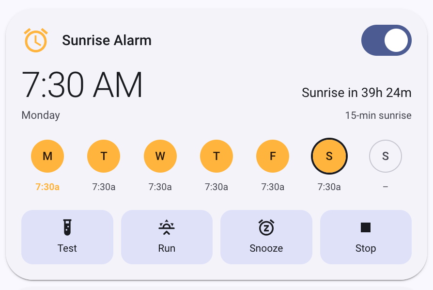
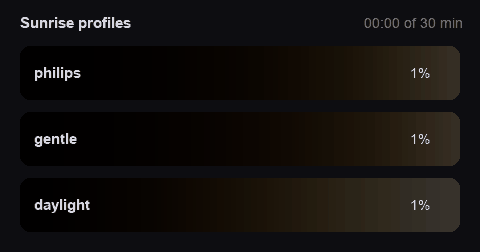

# Sunrise Alarm

[](https://hacs.xyz)

Home Assistant custom integration that turns any `light` entities into a
Philips-style wake-up light: a gradual sunrise of brightness and colour that
finishes at your wake-up time, at a time you set per day of the week.

<picture>
  <source media="(prefers-color-scheme: dark)" srcset="docs/card-dark.png">
  
</picture>

## Install

### HACS

HACS → ⋮ → **Custom repositories** → add
`https://github.com/sibizaestruch/sunrise-alarm` as an **Integration**, then
download *Sunrise Alarm* and restart Home Assistant.

### By hand

Copy `custom_components/sunrise_alarm` into `/config/custom_components/` and
restart. ZIP it for another machine with:

```bash
(cd custom_components && zip -r ../sunrise_alarm.zip sunrise_alarm -x '*__pycache__*')
```

Either way, finish with **Settings → Devices & services → Add integration →
Sunrise Alarm**.

## Use

One switch per alarm, e.g. `switch.bedroom_sunrise`: **on = armed**. Four
buttons run a sunrise by hand, no automation needed:

| Button | Effect |
| --- | --- |
| `button.<name>_test_sunrise_1_min` | One minute sunrise — for testing the bulb |
| `button.<name>_run_sunrise_now` | Sunrise at the configured duration |
| `button.<name>_snooze_9_min` | Lights off, sunrise again after the configured snooze time |
| `button.<name>_stop_sunrise` | Stops it, lights off, alarm stays armed |

Once the sunrise finishes the lights hold at full brightness for the
configured **extra light time** (0 = leave them on) and then switch off by
themselves.

The desired light state is computed from the clock every 5 seconds, so a
restart mid-sunrise resumes at the right progress and a missed tick fixes
itself.

The switch attributes: `phase`, `progress`, `remaining`, `schedule`, `days`,
`duration`, `profile`, `next_sunrise_start`, `next_wake`, `starts_in`,
`lights_off_at`. `schedule` is the wake time per weekday, e.g.
`{"mon": "07:00:00", "sat": "09:30:00"}`; a day that is not in it has no alarm,
and `days` is just its keys.

## Dashboard card

The integration ships its own Lovelace card and registers it itself — no
resource to add. Pick **Sunrise Alarm** in the card picker, or:

```yaml
type: custom:sunrise-alarm-card
entity: switch.bedroom_sunrise
```

`entity` is the alarm's switch; the buttons are found from the same device, so
there is nothing else to configure. The card leads with the next wake time and
its countdown, shows a progress bar while the sunrise runs, and ends with the
four manual buttons. Between them is the whole week, a column per day:

- **tap the chip** to turn that day on or off — switching one on borrows a time
  from the days already set;
- **tap the time under it** for the time picker; picking a time on a day that
  is off turns it on.

The next sunrise's day is the one in sun colour, an outline marks today, and
the card is the only place the schedule is edited — *Configure* covers the
lights and the curve.

All entities also share one device, so **Settings → Devices & services →
Sunrise Alarm → the device → Add to dashboard** builds a plain card if you
prefer one.

## Services

Every service targets the switch:

| Service | Fields | Effect |
| --- | --- | --- |
| `sunrise_alarm.start` | `duration` (minutes, optional) | Runs a sunrise now — use a short duration to test |
| `sunrise_alarm.stop` | — | Stops it and turns the lights off |
| `sunrise_alarm.snooze` | `minutes` (optional) | Lights off, then a 5 minute sunrise again. Defaults to the configured snooze time |
| `sunrise_alarm.set_schedule` | `schedule` (required) | Replaces the schedule, e.g. `{"sat": "09:30:00"}` — what the card edits |
| `sunrise_alarm.set_days` | `days` (required) | Runs on these weekdays only, e.g. `["sat", "sun"]`, keeping each day's time |

Testing with the real bulb:

```yaml
action: sunrise_alarm.start
target:
  entity_id: switch.bedroom_sunrise
data:
  duration: 1
```

## Profiles

Pick one in the config flow (and change it later under *Configure*):

| Profile | Shape |
| --- | --- |
| `philips` | Dim and red for a long time, strong surge at the end |
| `gentle` | Smooth ramp, no last-minute surge, warm to the end |
| `daylight` | Usable light early, ends near white — for dark mornings |



## Tuning the curve

A profile is just a list of control points in
`custom_components/sunrise_alarm/sunrise.py`. Edit them, or add a profile to
`PROFILES` and a label to `_PROFILE_LABELS` in `config_flow.py`, then look
before touching the bulb:

```bash
uv run python scripts/simulate_sunrise.py --duration 30 --profile gentle
```

## Development

```bash
uv sync            # installs homeassistant + pytest + ruff
uv run pytest
uv run ruff check .
```

Local Home Assistant with the integration mounted:

```bash
mkdir -p config/custom_components
ln -s ../../custom_components/sunrise_alarm config/custom_components/sunrise_alarm
docker run --rm -p 8123:8123 -v "$PWD/config:/config" \
  ghcr.io/home-assistant/home-assistant:stable
```

Then open http://localhost:8123. A `light.*` demo entity can be added with the
`demo` integration or a `template` light.

The brand icon is generated, not hand-drawn — edit and re-run:

```bash
uv run --no-project --with pillow python scripts/make_icon.py
```

So is the profiles GIF — re-run it after retuning the curves:

```bash
uv run --no-project --with pillow python scripts/make_profiles_gif.py
```

Hassfest validation:

```bash
docker run --rm -v "$PWD:/github/workspace" ghcr.io/home-assistant/hassfest:latest
```
